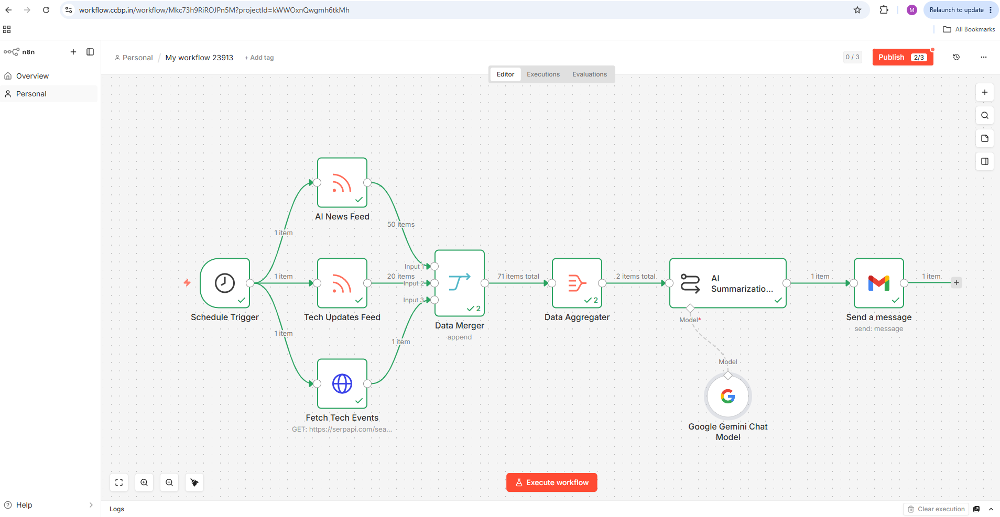

# AI News Summarizer

An AI-powered news and events intelligence pipeline built using RSS feeds, SerpAPI, Google Gemini, Gmail API, and n8n.

---

## Overview

This project automates the process of staying updated with AI and technology news while also tracking upcoming AI-related events.

Instead of manually visiting multiple websites every day, the workflow fetches articles from RSS feeds, discovers AI events using real-time web search, aggregates the information, summarizes it using Google Gemini, and sends a structured newsletter directly to Gmail.

---

## Problem Statement

Keeping up with AI and technology developments often requires:

- Visiting multiple websites
- Searching for relevant industry events
- Filtering large amounts of information manually
- Tracking news and events separately

This project automates the entire process by collecting news from RSS feeds, discovering AI-related events through search APIs, summarizing the most relevant updates using AI, and delivering a structured newsletter directly to email.

---

## Architecture

```text
Daily Schedule Trigger (10:00 AM)
                |
        -----------------
        |               |
        ↓               ↓
AI News RSS      Technology RSS
        |               |
        -----------------
                |
                ↓
         News Aggregator
                |
                ↓
         SERP API Search
      (AI Tech Events)
                |
                ↓
          Data Merge
                |
                ↓
          Aggregation
                |
                ↓
          Google Gemini
                |
                ↓
             Gmail
                |
                ↓
  Daily AI Intelligence Newsletter
```

---

## Key Features

- Automated execution every day at 10:00 AM
- AI news collection from RSS feeds
- Technology news collection from RSS feeds
- Real-time AI event discovery using SerpAPI
- Multi-source news aggregation
- AI-powered content summarization
- Categorized newsletter generation
- Automated Gmail delivery
- Scheduled workflow automation
- OAuth 2.0 secured integrations

---

## Technologies Used

### Automation

- n8n
- Workflow Automation

### Artificial Intelligence

- Google Gemini

### APIs & Integrations

- SerpAPI
- Gmail API
- Google OAuth 2.0
- RSS Feeds

### Cloud Services

- Google Cloud Platform

---

## How It Works

1. Schedule Trigger automatically starts the workflow at 10:00 AM.
2. RSS feeds fetch the latest AI news.
3. RSS feeds fetch the latest technology news.
4. SerpAPI searches the web for AI and technology-related events.
5. Data from all sources is merged together.
6. Articles and event information are aggregated.
7. Gemini generates a concise newsletter.
8. Gmail delivers the final newsletter automatically.

---

## Newsletter Sections

The generated newsletter includes:

### AI News Highlights

Key AI developments, product launches, research updates, and industry movements.

### Technology Updates

Important broader technology-related developments from trusted sources.

### Upcoming AI Events

Relevant AI conferences, summits, meetups, and technology events discovered through live search.

---

## Engineering Highlights

- Designed an end-to-end automated intelligence newsletter workflow
- Integrated multiple RSS news sources
- Integrated SerpAPI for real-time event discovery
- Implemented Google Gemini-powered summarization
- Automated Gmail newsletter delivery
- Configured OAuth 2.0 authentication
- Implemented data aggregation across multiple sources
- Built a scalable workflow architecture using n8n

---

## Version History

### Part 1

- AI News RSS Integration
- Technology News RSS Integration
- News Aggregation
- Gemini Summarization
- Gmail Newsletter Delivery

### Part 2

- SerpAPI Integration
- AI Event Discovery
- Event-Aware Newsletter Generation
- Enhanced Newsletter Structure
- Multi-source Intelligence Aggregation

---

## 📸 Screenshots

### Workflow Overview





### Email Output


---

## What I Learned

- RSS Feed Integration
- Workflow Orchestration with n8n
- Google Gemini Integration
- Gmail API Integration
- OAuth 2.0 Authentication
- Prompt Engineering
- Automated Newsletter Generation
- API Integration using HTTP Request Nodes
- Real-time Search Integration using SerpAPI
- Multi-source Data Aggregation

---

## Future Improvements

- Personalized topic preferences
- Event relevance ranking
- Slack integration
- Microsoft Teams integration
- Telegram integration
- AI-based article prioritization
- HTML email templates
- Multi-recipient newsletters
- Event calendar integration
- Duplicate article detection

---

## Security

No API keys, OAuth secrets, access tokens, credentials, or sensitive configuration data are stored in this repository.

---

## Author

**Mohammed Khaja Moinuddin**

AI-powered workflow automation project built using n8n, Google Gemini, Gmail API, RSS feeds, and SerpAPI.
