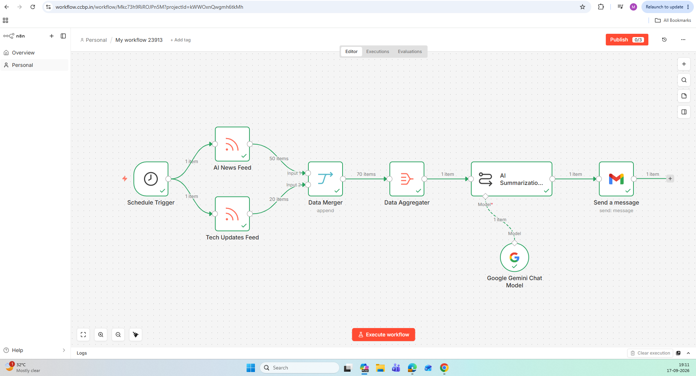
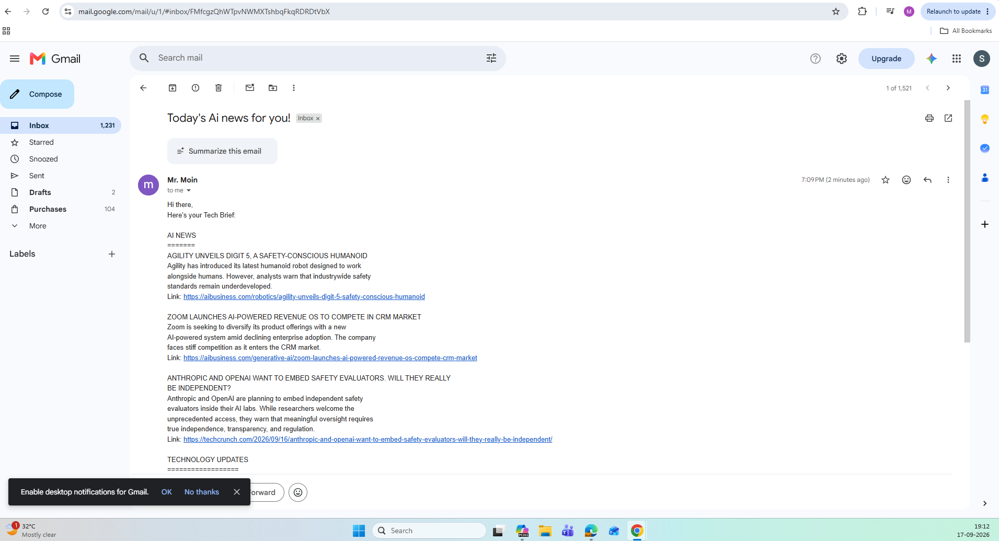

# AI News Summarizer

An AI-powered news aggregation and email summarization pipeline built using RSS feeds, Google Gemini, Gmail API, and n8n.

---

## Overview

This project automates the process of staying updated with AI and technology news.

Instead of manually visiting multiple websites every day, the workflow fetches articles from RSS feeds, aggregates them, summarizes the content using Google Gemini, and sends a structured newsletter directly to Gmail.

---

## Problem Statement

Keeping up with AI and technology news often requires visiting multiple websites and filtering large amounts of information manually.

This project automates that process by collecting news from RSS feeds, summarizing the most relevant updates using AI, and delivering a structured newsletter to email every day at 10:00 AM.

---

## Architecture

```text
Daily Schedule Trigger (10:00 AM)
        ↓
AI News RSS Feed
        ↓
Technology News RSS Feed
        ↓
Merge
        ↓
Aggregate
        ↓
Google Gemini
        ↓
Gmail
        ↓
Daily News Summary
```

---

## Key Features

- Automated execution every day at 10:00 AM
- Automated news collection from RSS feeds
- Multiple news source integration
- AI-powered news summarization
- Daily email newsletter delivery
- Scheduled workflow execution
- OAuth 2.0-secured integrations

---

## Technologies Used

### Automation

- n8n
- Workflow Automation

### AI

- Google Gemini

### APIs & Cloud

- Google Cloud Platform
- Gmail API
- Google OAuth 2.0
- RSS Feeds

---

## How It Works

1. Schedule Trigger automatically starts the workflow every day at 10:00 AM.
2. RSS feeds fetch AI and technology news.
3. News articles are merged into a single stream.
4. Content is aggregated.
5. Gemini generates concise summaries.
6. Gmail sends the newsletter automatically.

---

## Engineering Highlights

- Designed a scheduled daily automation workflow that runs at 10:00 AM
- Implemented scheduled workflow automation
- Integrated multiple RSS data sources
- Used AI for content summarization
- Configured Gmail OAuth authentication
- Automated newsletter generation and delivery
- Designed an end-to-end news aggregation pipeline

---

## 📸 Screenshots

### Workflow Overview



### Email Output



---

## What I Learned

- RSS Feed Integration
- Workflow Orchestration with n8n
- Gmail API Integration
- OAuth 2.0 Authentication
- Prompt Engineering
- AI-Assisted Content Summarization

---

## Future Improvements

- Personalized topic selection
- Slack integration
- Telegram integration
- News ranking and prioritization
- Article categorization using AI
- Multi-recipient newsletters

---

## Security

No API keys, OAuth secrets, access tokens, or credentials are stored in this repository.
